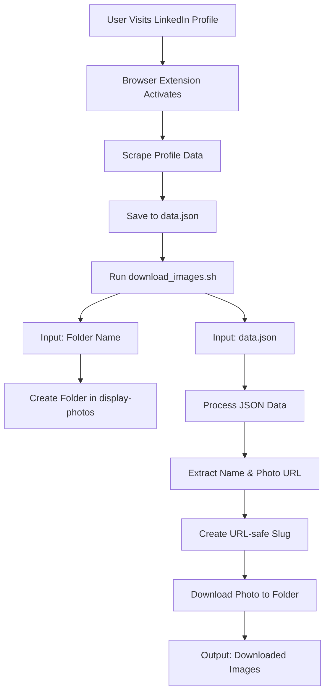

# LinkedIn Profile Scraper Browser Extension

A Chrome extension that extracts LinkedIn profile information including name, profile picture, and bio.

## Features
- Extracts profile data from LinkedIn profile pages
- Downloads profile pictures using included shell script
- Simple popup interface

## Installation
1. Clone this repository
2. Open Chrome and go to `chrome://extensions/`
3. Enable "Developer mode" in the top right
4. Click "Load unpacked" and select the extension directory

## Usage
1. Navigate to a LinkedIn profile page (e.g. `https://www.linkedin.com/in/username`)
2. Click the extension icon in the toolbar
3. View extracted profile information in the popup

## Script Functionality
The `download_images.sh` script:
- Takes a folder name as parameter
- Creates the folder inside display-photos directory
- Takes a JSON array of profile data
- Processes each profile to:
  - Extract name and photo URL
  - Create a URL-safe slug from the name
  - Download the profile photo into the specified folder using curl
- Requires `jq` for JSON processing

## Workflow

## Requirements
- Chrome browser
- `jq` installed (for script functionality)
- Bash shell (for script execution)

## Permissions
This extension requires the following permissions:
- Access to LinkedIn profile pages
- Ability to download files
- Access to active tabs

## Disclaimer
This extension is for educational purposes only. Use responsibly and in compliance with LinkedIn's terms of service.